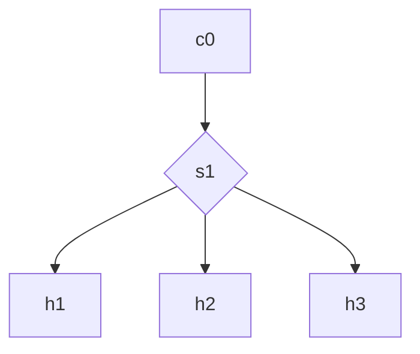

Bora! Começar! 
# Laboratório básico sobre Mininet e OpenFlow

O objetivo destes laboratórios é revisar e aprender sobre o funcionamento do protocolo OpenFlow , Open vSwitch e Redes Definidas por Software. 
Neste em específico vou documentar a experiência sobre a utilização básica e fundamentos do Mininet

Para execução desse laboratório é necessário a instalação de alguns pacotes antes. 
Esse laboratório foi elaborado no Ubuntu 26.04 Desktop 

```
$ sudo lsb_release -a
	No LSB modules are available.
	Distributor ID:	Ubuntu
	Description:	Ubuntu 26.04 LTS
	Release:	26.04
	Codename:	resolute
``` 

E para isso instalei os pacotes 
`$ sudo apt install -y mininet openvswitch-switch openvswitch-common
`$ sudo apt install ovs-testcontroller
`$ sudo apt install openvswitch-testcontroller

### Execução 
Após a instalação, execute o arquivo do laboratório
`$ ./commands.sh 

O gráfico abaixo representa a topologia criada

* c0 é o controlador da rede
* s1 é o switch
* h1, h2 e h3 são os hosts adicionados
Todos estão conectados ao vSwitch

### Notas sobre os comandos
Após aparecer o prompt do mininet poderá testar os seguintes comandos listados abaixo:
Quando aparecer '$' na frente, o comando deverá ser executado em um prompt convencional do linux, não no do mininet.
* `nodes
* `net
* `dump
* `pingall
* `h1 ping h3
* Para o funcionamento do controlador da rede c0
  `py c0.stop() 
* Inicia o funcionamento do controlador da rede c0
  `py c0.start()  
* Exibir informações da topologia da rede 
  ` $ sudo ovs-vsctl show
  

### Referências:
1. https://mininet.org/sample-workflow/

