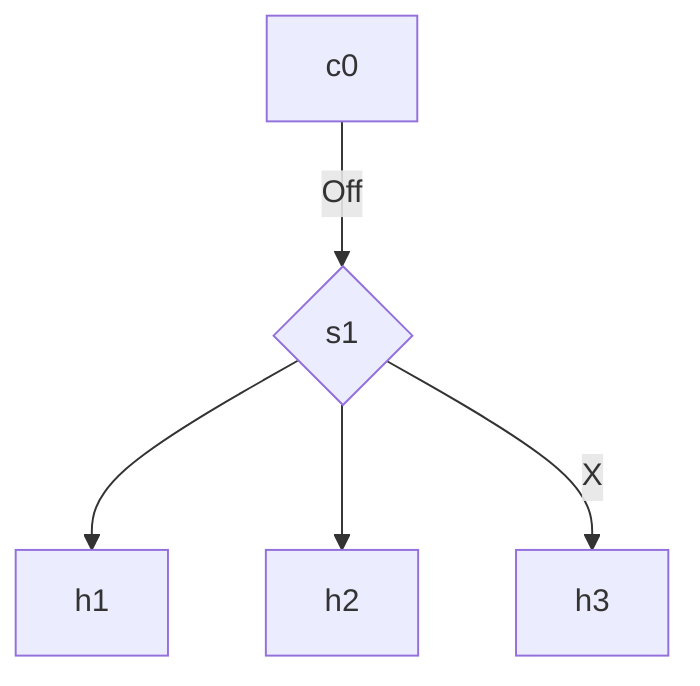

# Lab 02 - Open vSwitch e Regras OpenFlow Manuais
Entender como o vSwitch encaminha pacotes sem depender diretamente do controlador.

### Configurando e limpando regras de fluxo
1. Subir a mesma topologia do lab01.
   
2. Confirmar se tudo está funcionando como esperado.
   ` pingall
   
3. Parar controlador
   `py c0.stop()
   
4. Em outro terminal confirme o status da topologia.
   `$ sudo ovs-vsctl show 
   
5. Para listar os Controllers e ver o status do controlador atual
   `$ sudo ovs-vsctl list Controller 
   Pode confirmar que o controlador está desconectado em `is_connected: false ` .
   O último erro foi uma tentativa de conexão do switch: ` last_error="Connection refused" ` 
   
6. Listar as regras de fluxo do s1: 
   ` $ sudo ovs-ofctl -O OpenFlow13 dump-flows s1 
   Neste momento ele ainda deve ter as regras que direcionam o fluxo para o controlador.
   ` actions=CONTROLLER:128 `  

7. Limpar as regras de fluxo do s1
   ` $ sudo ovs-ofctl -O OpenFlow13 del-flows s1 `
   Neste momento o comando do iten 6 não retornará nada.
   No mininet o comando ` pingall ` mostrará falha na conexão entre os hosts: 
```shell
mininet> pingall
*** Ping: testing ping reachability
h1 -> X X 
h2 -> X X 
h3 -> X X 
*** Results: 100% dropped (0/6 received) 
```


### Programar o switch manualmente
1. Confirmar o mapeamento das conexões e estrutura da topologia da rede: 
```shell
mininet> net
	h1 h1-eth0:s1-eth1
	h2 h2-eth0:s1-eth2
	h3 h3-eth0:s1-eth3
	s1 lo:  s1-eth1:h1-eth0 s1-eth2:h2-eth0 s1-eth3:h3-eth0
	c0
mininet> 
``` 

2. Criando uma conexão entre h1 e h2 apenas. 
```shell 
$ sudo ovs-ofctl -O OpenFlow13 add-flow s1 \ 
"priority=100, in_port=1, actions=output:2"

$ sudo ovs-ofctl -O OpenFlow13 add-flow s1 \ 
"priority=100, in_port=2, actions=output:1"
```       

3. Conferindo regras atuais
```shell
$ sudo ovs-ofctl -O OpenFlow13 dump-flows s1 
   cookie=0x0, duration=238.965s, table=0, n_packets=0, n_bytes=0, priority=100,in_port="s1-eth1" actions=output:"s1-eth2"
	 cookie=0x0, duration=217.870s, table=0, n_packets=0, n_bytes=0, priority=100,in_port="s1-eth2" actions=output:"s1-eth1"
```

4. Fazer testes de conexão 
```shell
pingall
	& 
	h1 ping -c 3 h2
	&
	h1 ping -c 3 h3
```

Resultados esperados, como pode ser visto abaixo, é a comunicação entre os hosts h1 e h2, e a falta de comunicação entre h3 para h1 e h2: 

```shell
mininet> pingall
*** Ping: testing ping reachability
h1 -> h2 X 
h2 -> h1 X 
h3 -> X X 
*** Results: 66% dropped (2/6 received)


mininet> h1 ping -c 3 h3
PING 10.0.0.3 (10.0.0.3) 56(84) bytes of data.
From 10.0.0.1 icmp_seq=1 Destination Host Unreachable
From 10.0.0.1 icmp_seq=2 Destination Host Unreachable
From 10.0.0.1 icmp_seq=3 Destination Host Unreachable

--- 10.0.0.3 ping statistics ---
3 packets transmitted, 0 received, +3 errors, 100% packet loss, time 2072ms
pipe 3


mininet> h1 ping -c 3 h2
PING 10.0.0.2 (10.0.0.2) 56(84) bytes of data.
64 bytes from 10.0.0.2: icmp_seq=1 ttl=64 time=0.418 ms
64 bytes from 10.0.0.2: icmp_seq=2 ttl=64 time=0.151 ms
64 bytes from 10.0.0.2: icmp_seq=3 ttl=64 time=0.075 ms

--- 10.0.0.2 ping statistics ---
3 packets transmitted, 3 received, 0% packet loss, time 2077ms
rtt min/avg/max/mdev = 0.075/0.214/0.418/0.147 ms
```

5.  Diagrama atual da rede



6. Regras do tabela de roteamento
```
in_port=1,actions=output:2
```

| MATCH     | ACTION   | Pacotes     | Qtd bytes   | Tempo da regra   |
| --------- | -------- | ----------- | ----------- | ---------------- |
| in_port=1 | output:2 | n_packets=7 | n_bytes=100 | duration=63.251s |

### Testando regras personalizadas apenas para ARP
A regra anterior fala que, qualquer tipo de pacote que entrar pala porta eth1, mande para eth2, e o que entrar pela eth2 mande para a eth1. 

Então vamos ser mais específico e informar nas regras de fluxo que os pacotes que serão encaminhados serão apenas do protocolo ARP

**ARP**
```
$ sudo ovs-ofctl -O OpenFlow13 del-flows

$ sudo ovs-ofctl -O OpenFlow13 add-flow s1 \
"priority=100,arp,in_port=1,actions=output:2"

$ sudo ovs-ofctl -O OpenFlow13 add-flow s1 \
"priority=100,arp,in_port=2,actions=output:1"

$ sudo ovs-ofctl -O OpenFlow13 dump-flows s1
```
Agora a regra é a seguinte
```
ARP porta 1 → porta 2
ARP porta 2 → porta 1
```

Testando no mininet, o ping não terá resultado  ou seja o icmp, não está funcionando, mas o protocolo arp está: 
```shell
mininet> pingall
*** Ping: testing ping reachability
h1 -> X X 
h2 -> X X 
h3 -> X X 
*** Results: 100% dropped (0/6 received)
mininet> h1 arp -n
Endereço                 TipoHW  EndereçoHW          Flags Mascara         Iface
10.0.0.2                 ether   00:00:00:00:00:02   C                     h1-eth0
10.0.0.3                         (incompleto)                              h1-eth0
mininet> h2 arp -n
Endereço                 TipoHW  EndereçoHW          Flags Mascara         Iface
10.0.0.1                 ether   00:00:00:00:00:01   C                     h2-eth0
10.0.0.3                         (incompleto)                              h2-eth0
mininet> h3 arp -n
Endereço                 TipoHW  EndereçoHW          Flags Mascara         Iface
10.0.0.1                         (incompleto)                              h3-eth0
10.0.0.2                         (incompleto)                              h3-eth0
mininet> h1 ping -c 3 h2
PING 10.0.0.2 (10.0.0.2) 56(84) bytes of data.
^C
--- 10.0.0.2 ping statistics ---
3 packets transmitted, 0 received, 100% packet loss, time 2063ms

mininet> 
```

